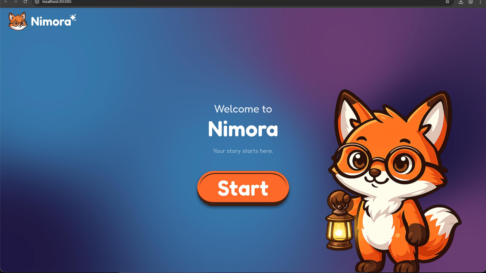
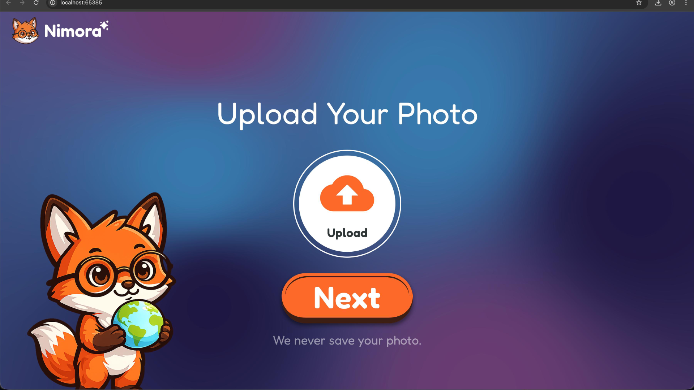
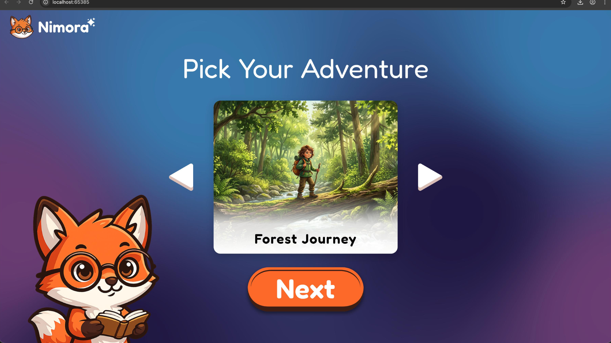
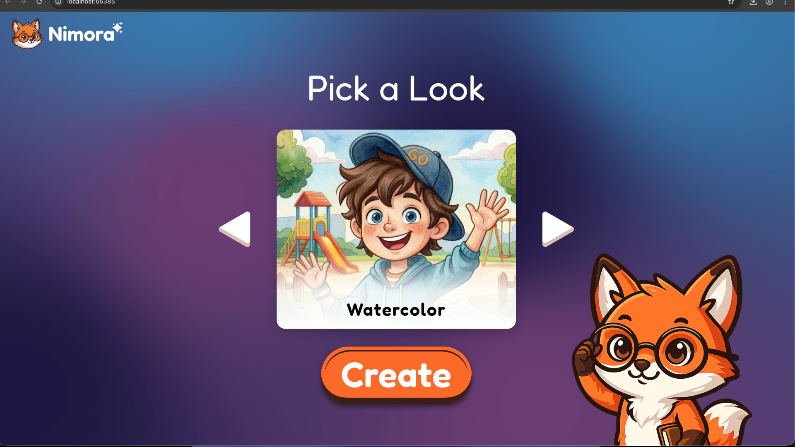
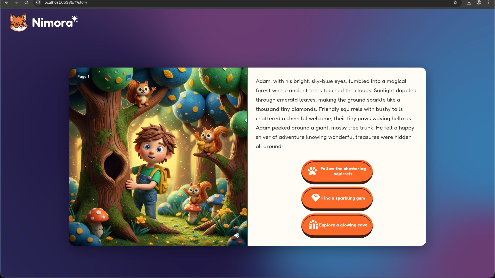
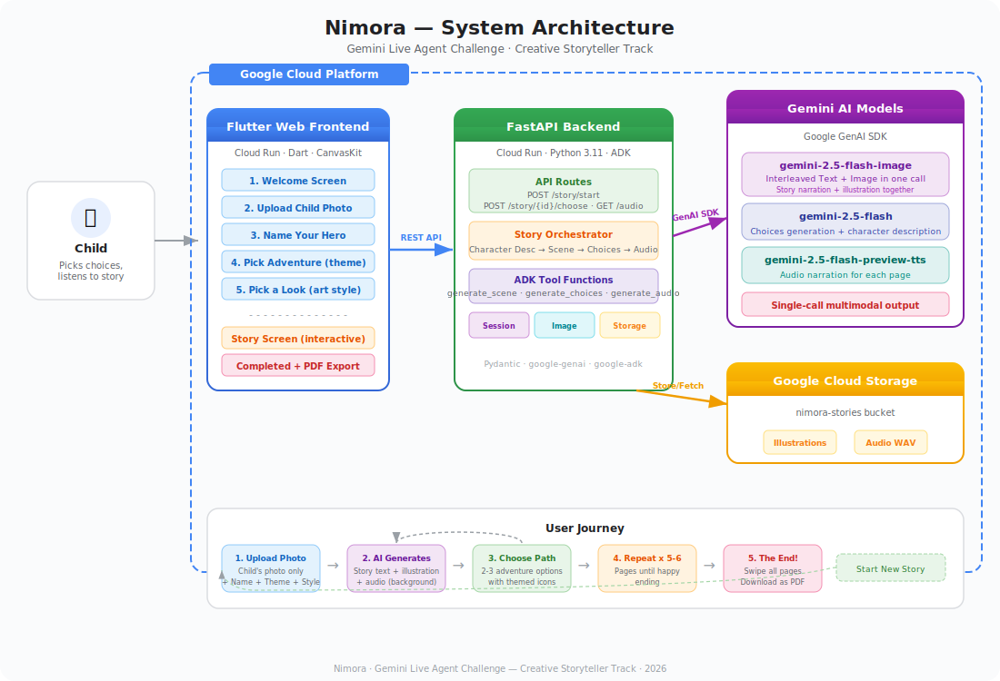

# Nimora

**Every child is the hero of their story**

An interactive AI-powered storybook app where parents upload their child's photo, and Gemini generates a personalized, illustrated story with the child as the hero. Built for the **Gemini Live Agent Challenge — Creative Storyteller** track.

---

## Screenshots

### Welcome


### Upload Photo


### Pick Your Adventure


### Choose Art Style


### Interactive Story


---

## Problem Statement

Children's stories today are generic — every kid reads the same characters, the same plots, the same illustrations. Parents want their child to feel special, to see themselves as the hero, but personalized storybooks are expensive, take weeks to produce, and offer zero interactivity. Meanwhile, children lose interest in passive stories where they have no agency over what happens next.

**The gap:** There is no accessible, real-time way to create a fully personalized, illustrated, interactive story where a child sees themselves in the art and chooses their own adventure — all generated instantly.

## Our Solution

Nimora solves this by combining three Gemini capabilities into one seamless experience:

1. **Interleaved text + image generation** — A single Gemini call produces both the story narration and an illustration featuring the child's likeness. No separate image API, no stitching — one model, one call, coherent output.
2. **Interactive branching** — After each page, the child picks from 2-3 choices that shape the story. Every playthrough is unique.
3. **Audio narration** — Gemini TTS reads each page aloud, making stories accessible to pre-readers and turning screen time into storytime.

The result: a parent uploads a photo, the child picks a theme, and within seconds they're inside a fully illustrated, voice-narrated adventure where they are the hero — and they decide what happens next.

**Key highlight**: The child's photo is **never saved** — only used in-memory for AI generation.

## Features

- **Personalized illustrations** — AI generates images featuring the child's likeness from their photo
- **Interactive storytelling** — Choose your own adventure with 2-3 options per page
- **Audio narration** — Gemini TTS reads each page aloud with a child-friendly voice
- **5-6 page stories** — Complete narrative arc from opening to happy ending
- **8 story themes** — Forest Journey, Space Mission, Pirate Island, Dinosaur World, Magic Kingdom, Ocean Quest, Desert Treasure, Castle Mystery
- **4 art styles** — Watercolor, Digital Painting, 3D, Claymation
- **PDF export** — Save and print the completed story
- **Interleaved generation** — Text and images produced together in one Gemini call

## Architecture



## Tech Stack

| Component | Technology |
|---|---|
| **Interleaved Model** | `gemini-2.5-flash-image` — text + image in one call |
| **Orchestrator Model** | `gemini-2.5-flash` — choices and character descriptions |
| **TTS Model** | `gemini-2.5-flash-preview-tts` — audio narration |
| **AI SDK** | Google GenAI SDK + Google ADK |
| **Backend** | Python 3.11+ / FastAPI |
| **Frontend** | Flutter Web (Dart) |
| **Cloud Hosting** | Google Cloud Run (backend + frontend) |
| **Storage** | Google Cloud Storage (illustrations + audio only) |
| **Containerization** | Docker + Docker Compose |

## Prerequisites

- Python 3.11+
- Flutter SDK (3.2+)
- Google Cloud account with billing enabled
- Gemini API key
- Docker and Docker Compose (for containerized setup)

## Local Development Setup

### Backend

```bash
cd backend

# Create virtual environment
python -m venv .venv
source .venv/bin/activate

# Install dependencies
pip install -e .

# Configure environment
cp .env.example .env
# Edit .env and add your GOOGLE_API_KEY

# Run the server
uvicorn main:app --reload --port 8000
```

The API will be available at `http://localhost:8000`. Check health at `http://localhost:8000/api/health`.

### Frontend

```bash
cd frontend

# Install dependencies
flutter pub get

# Run in Chrome
flutter run -d chrome
```

The app will open in your browser pointing to the local backend.

## Docker Setup

Run the full stack with Docker Compose:

```bash
docker-compose up --build
```

- Backend: `http://localhost:8000`
- Frontend: `http://localhost:8080`

## Cloud Run Deployment

```bash
# Set your GCP project
gcloud config set project YOUR_PROJECT_ID

# Run the deployment script
chmod +x deployment/deploy.sh
./deployment/deploy.sh
```

This deploys both backend and frontend to Cloud Run and configures Cloud Storage CORS.

## API Endpoints

| Method | Endpoint | Description |
|---|---|---|
| `POST` | `/api/story/start` | Start a new story (multipart: photo, name, theme, style) |
| `POST` | `/api/story/{session_id}/choose` | Continue story with a choice |
| `GET` | `/api/story/{session_id}/audio/{page_number}` | Poll for audio URL |
| `GET` | `/api/story/{session_id}` | Get all pages for a story session |
| `GET` | `/api/health` | Health check |

## Project Structure

```
nimora/
├── README.md
├── docker-compose.yml
├── docs/
│   ├── architecture.svg              # System architecture diagram
│   └── screenshots/                  # App screenshots
├── backend/
│   ├── Dockerfile
│   ├── main.py                       # FastAPI entry point
│   ├── config.py                     # App settings (Pydantic)
│   ├── pyproject.toml
│   ├── api/
│   │   └── routes.py                 # API route handlers
│   ├── services/
│   │   ├── gemini_service.py         # Gemini API (interleaved output)
│   │   ├── tts_service.py            # Gemini TTS audio narration
│   │   ├── storage_service.py        # Cloud Storage / local storage
│   │   ├── image_service.py          # Image processing (PIL)
│   │   ├── session_service.py        # In-memory session management
│   │   └── story_orchestrator.py     # Story generation pipeline
│   ├── story_agent/
│   │   ├── agent.py                  # ADK Agent definition
│   │   ├── tools.py                  # ADK tool functions
│   │   └── prompts.py               # Prompt templates
│   └── models/
│       └── schemas.py                # Pydantic models
├── frontend/
│   ├── Dockerfile
│   ├── pubspec.yaml
│   └── lib/
│       ├── main.dart                 # App entry + routing
│       ├── theme/
│       │   └── app_theme.dart        # Storybook theme & colors
│       ├── models/
│       │   ├── child_info.dart       # Child input data
│       │   ├── story_page.dart       # Story page model
│       │   └── story_session.dart    # Session state
│       ├── providers/
│       │   └── story_provider.dart   # State management (Provider)
│       ├── services/
│       │   ├── api_service.dart      # REST API client
│       │   ├── audio_service.dart    # Web audio player
│       │   └── pdf_service.dart      # PDF export
│       ├── screens/
│       │   ├── landing_screen.dart   # Onboarding flow
│       │   ├── story_screen.dart     # Interactive story
│       │   └── completed_screen.dart # Story complete + PDF
│       ├── widgets/
│       │   ├── animated_starry_background.dart
│       │   ├── app_header.dart
│       │   ├── loading_magic.dart
│       │   ├── nimora_button.dart
│       │   ├── photo_preview.dart
│       │   ├── story_book_layout.dart    # Desktop book view
│       │   ├── story_mobile_layout.dart  # Mobile stacked view
│       │   ├── story_page_widget.dart    # Page coordinator
│       │   └── steps/                    # Onboarding steps
│       │       ├── welcome_step.dart
│       │       ├── upload_step.dart
│       │       ├── name_step.dart
│       │       ├── adventure_step.dart
│       │       ├── look_step.dart
│       │       ├── step_data.dart
│       │       └── carousel_helpers.dart
│       └── utils/
│           ├── constants.dart
│           ├── icon_map.dart
│           ├── url_helpers.dart
│           └── web_download.dart
└── deployment/
    ├── deploy.sh                     # Cloud Run deployment script
    └── cors.json                     # GCS CORS configuration
```

## How It Works

### Onboarding (5 steps)
1. **Welcome** — The Nimora fox greets the child
2. **Upload Photo** — Child uploads their photo (never saved — used only in-memory for AI)
3. **Name Your Hero** — Enter the hero's name
4. **Pick Your Adventure** — Choose a theme: Forest Journey, Space Mission, Pirate Island, etc.
5. **Pick a Look** — Choose an art style: Watercolor, Digital Painting, 3D, or Claymation

### Story Generation (per page)
1. **Character Description** — On the first page, Gemini analyzes the photo and creates a consistent character description used across all illustrations
2. **Generate Scene** — The Story Orchestrator calls `gemini-2.5-flash-image` to produce story text + illustration in a single interleaved call
3. **Audio Narration** — `gemini-2.5-flash-preview-tts` generates a voice narration in the background
4. **Choose Your Path** — The child picks from 2-3 choices with themed icons for what happens next
5. **Repeat** — Steps 2-4 repeat for 5-6 pages, each scene building on previous choices

### The End
- A happy, empowering conclusion wraps the story
- Swipe through all pages to re-read
- Download the complete story as a **PDF** to save or print
- Start a new story anytime

## Hackathon

Built for the **Gemini Live Agent Challenge — Creative Storyteller** track.

- **Gemini interleaved output** — Text and images generated together in one call (key Creative Storyteller requirement)
- **Gemini TTS** — Audio narration for each story page
- **Google GenAI SDK + ADK** — Agent orchestration with tool-based architecture
- **Google Cloud Run** — Serverless deployment for both backend and frontend
- **Google Cloud Storage** — Persistent illustration and audio storage (child photos are never saved)

## Future Ideas

- Arabic language story generation
- Multi-child stories with siblings
- More themes and customization options
- Save stories to user accounts

## Team

- **UI/UX Design** — [Ahmed Elblasy](https://elblasy.com)
- **Development** — [Muhammad Elblasy](https://elblasy.app)

## License

MIT
